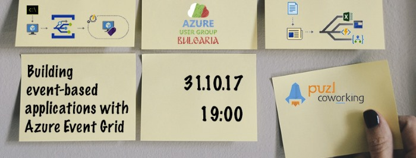

# Building event-based applications with Azure Event Grid

Azure Event Grid is a fully-managed event service for managing events across many different platforms and applications. One of its goals is to simplify the creation of event-based systems and applications. The session will focus on introducing Azure Event Grid, comparing Event Grid to other event-based services like Service Bus and Queues, and finally exploring how Event Grid can help with building event-based application.

## Speaker / Лектор

[Milan Nankov / Милан Нанков](https://www.linkedin.com/in/nankov/)