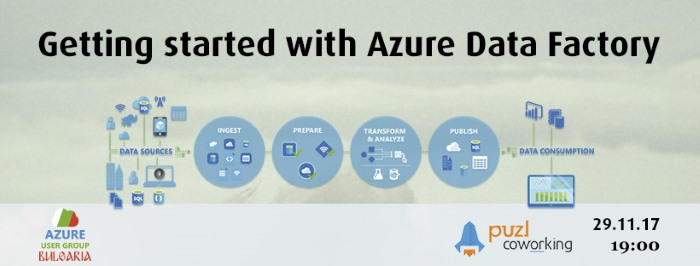

# Getting started with Azure Data Factory

Azure Data Factory is the modern ELT/ETL service in Azure that can orchestrate your entire set of data workflows - from IOT data to traditional on-prem sources. The focus of the session will be getting started with ADF, understanding the main components of an ADF solution,learning some real customer implementations and discussing the roadmap of the product after the latest announcements on Microsoft Ignite.

## Speaker / Лектор

Ivan Donev is a Premier Field Engineer at Microsoft, working extensively with data platform products for more than 10 years. He is a conference speaker, blogger and holds various certifications on Microsoft's Data Platform product stack.

[Ivan Donev / Иван Донев](https://www.linkedin.com/in/ikdonev/)